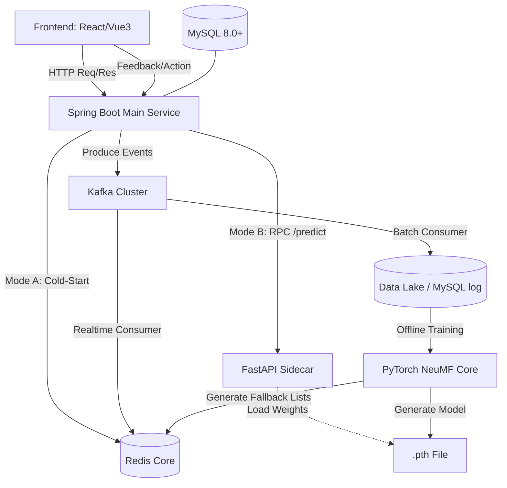

# SPEC - 基于多源融合与大模型协同的推荐系统 (MovieRec-NNCF)

## Part 1: 需求对齐

**原始需求:** 
基于 `Agent.md` 文档提供的七个核心模块，完成整个工业级电影推荐系统的全栈开发。需要按照 6A 工作流执行，全权负责系统架构、任务拆分、以及 Git 版本控制规划。

**边界确认:**
- **数据库层**：MySQL 8.0+ (高频读写，表设计优化、分区索引)；Redis (热门排行榜、会话特征、语义缓存)。
- **数据工程**：Python + Pandas/PyTorch 处理 MovieLens 1M 数据集，动态正负比例采样并划分数据集。
- **深度模型层**：PyTorch 实现 NeuMF (GMF 和 MLP 双通道融合) 模型内核。
- **推理微服务**：基于 FastAPI 构建极低延迟批量推理计算节点 (Sidecar)。
- **主业务服务**：基于 Spring Boot 3.x，设计双模式动态路由（冷启动降级 vs 深度个性化 RPC 推理）。
- **消息与闭环**：基于 Spring Kafka 捕获用户隐式与显式反馈事件，实现实时特征更新与离线重训闭环。
- **前端页面**：使用 React/Vue3 + Tailwind 构建现代化瀑布流界面，带有微交互与防抖。

**Git 版本控制规划:**
- 分支模型:
  - `main`: 生产稳定分支，对应里程碑版本。
  - `dev`: 开发主分支。
  - 特性分支：依任务划分为 `feat/m1-infra`, `feat/m2-data`, `feat/m3-model`, `feat/m4-inference`, `feat/m5-springboot`, `feat/m6-kafka`, `feat/m7-frontend`。
- 提交流程: 采用 Conventional Commits 规范 (如 `feat:`, `fix:`, `docs:`, `chore:`)。

## Part 2: 架构设计

### 整体架构图

### 核心组件设计
1. **持久化与缓存**: MySQL 维护强一致性数据；Redis 提供亚毫秒级响应机制。
2. **PyTorch 算法管线**: 包含数据工程特征映射与模型训练，产出推理权重。
3. **FastAPI 推理节点**: 提供单节点内的无状态极速推断评估。
4. **Spring Boot 主导业务**: 处理对外 API 与鉴权、路由判定、Fallback 与熔断机制隔离风险。
5. **Kafka 事件总线**: 彻底解耦高并发用户埋点行为与后续的数据消费需求。

## Part 3: 任务拆分

| 编号 | 任务名称 | 前置依赖 | 输入契约 | 输出契约 |
|---|---|---|---|---|
| **P0** | 初始化项目工程与 Git 环境 | 无 | 项目规范与 SPEC | 初始化完成的 Git 仓库、分支环境结构 |
| **M1** | 基础设施与持久化层建设 | P0 | MySQL DDL 与 Redis 约束 | `sql/schema.sql`，缓存格式设计文档 |
| **M2** | 数据工程与离线特征管道 | M1 | MovieLens 1M 原始数据 | Python 特征工程脚本，结构化数据集输出 |
| **M3** | 神经矩阵分解深度模型构建 | M2 | 二值化特征集 | PyTorch 模型代码，训练循环，`model.pth` |
| **M4** | FastAPI 推理边车微服务 | M3 | `model.pth` | 纯 Python 边车应用，即插即用的 `/api/predict` |
| **M5** | Spring Boot 核心业务与路由 | M1, M4 | Swagger 定义，缓存/RPC 诉求 | Java REST API，集成 Resilience4j，双模调度逻辑 |
| **M6** | Kafka 的异步反馈机制 | M5 | 用户埋点事件字典 | 生产者/消费者类，实时/离线写出业务 |
| **M7** | 现代化前端展示与交互 | M5, M6 | API 联调端点 | `src` 前端源码，深色模式 UI 组件 |

---
**审批阶段 (Approve) 提醒:**
规范已生成。请阅读本 SPEC 文档，如需求和边界无误，我们将进入 Automate 阶段，自动开辟分支执行核心功能的搭建。
