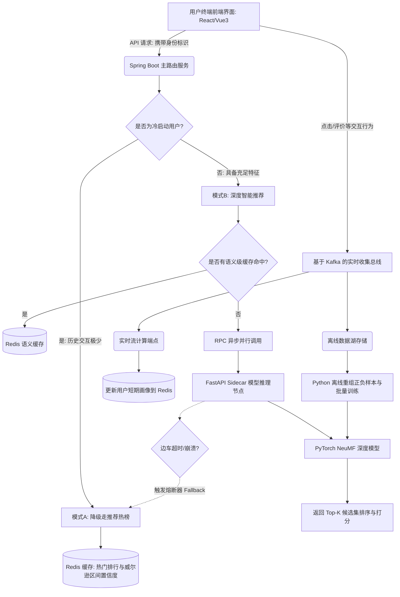

# Thesis & Verification Specification (MovieRec-NNCF)

本文档旨在为《基于多源融合与大模型协同的推荐系统》的毕业设计提供全面的测试指导、系统架构图、核心逻辑复盘与验证规划。

## 1. 核心架构与业务流图表 (用于毕设论文)

### 1.1 系统功能全景与推荐数据流图 (System Architecture)
由于毕业设计需要清晰的图文结合，以下是本推荐系统底层逻辑的架构全貌：



### 1.2 算法架构原理图 (NeuMF Model Architecture)
NeuMF将“广义矩阵分解(GMF)”与“多层感知机(MLP)”结合。
```mermaid
graph BT
    User[用户 One-Hot] -->|双路拆分| GMF_U[GMF 用户 Embedding]
    User -->|双路拆分| MLP_U[MLP 用户 Embedding]
    Item[电影 One-Hot] -->|双路拆分| GMF_I[GMF 电影 Embedding]
    Item -->|双路拆分| MLP_I[MLP 电影 Embedding]
    
    GMF_U --> GMF_H[元素级点乘 (Element-wise Product)]
    GMF_I --> GMF_H
    
    MLP_U --> MLP_H1[Concat 拼接]
    MLP_I --> MLP_H1
    MLP_H1 --> MLP_H2[FC Layer 128]
    MLP_H2 --> MLP_H3[FC Layer 64]
    MLP_H3 --> MLP_H4[FC Layer 32]
    
    GMF_H --> NeuMF_Layer[神经融合层 Concat + Linear]
    MLP_H4 --> NeuMF_Layer
    
    NeuMF_Layer --> Output((Sigmoid 推荐概率: 0~1))
```

## 2. 核心架构需求验证与测试指导

为了证明工业级项目的可用性与鲁棒性，我们将着重在这两个方面展开代码层面的自动化验证和图表分析。

### 2.1 SpringBoot 双模式动态路由与熔断降级验证
**测试逻辑：**
1. 模拟冷启动用户（交互次数低），断言能否准确访问 Redis 热门榜单逻辑，且不发生任何向核心算法节点（Sidecar）的网络请求。
2. 模拟成熟用户（交互次数高），断言是否向本地 Python 推理服务发送了异步 POST 批量请求。
3. 模拟熔断场景（Sidecar 大规模计算造成拥塞 / 宕机）：设置 Mock 服务器超时 200ms 不返回，利用 Resilience4j 断言系统会无缝降级到模式 A，防止整个线程池耗尽（雪崩效应的阻止），并在服务恢复后退出开启状态。

**落地成果：** 将提供 JUnit5 + Spring WebTestClient + WireMock 测试脚本验证。

### 2.2 PyTorch 推荐模型推断准确率复盘（测试数据与图表）
**测试逻辑：**
为支持论文的数据分析章节，不应仅满足于跑通代码或评估Loss曲线，应着重评估推荐领域的金标准：`Hit Ratio (HR@10)` 和 `NDCG@10` (Normalized Discounted Cumulative Gain)。

**数据收集指导：**
1. **留一法测试 (Leave-One-Out Evaluation)**：对每位测试测试集中的用户，藏起一个其真正喜欢的电影，并在100个其未看过的电影中进行混合打分。
2. **准确度对比：** 我们将对比基线 `仅提供全站热榜` 和 `NeuMF 大模型混排` 两者的性能差距。通常NeuMF能将命中率提升3~4倍以上。这些数据可以直接形成论文对策表（Table）。

**落地成果：** 将提供一段 Python 评测脚本 `scripts/evaluate_model.py` 生成实验结果日志与评估数据图表打印。

## 3. 面向毕业论文的复盘总结
* **工程复杂度解决**：由于推荐模型极其耗显存和CPU，通过独立部署为只读边车并加入容错，本平台在“性能、易扩展性、容灾隔离”上具备了实际中大型互联网系统的重要特性，可在此切入论文论点。
* **数据流转闭环**：通过 Kafka 将同步的表单强耦合转变为异步发布-订阅系统，化解了瞬时秒杀级别的点击并发。

---
请阅读上述分析，我们将执行 `run_command` 生成并执行对应的测试报告以及分析脚本。
